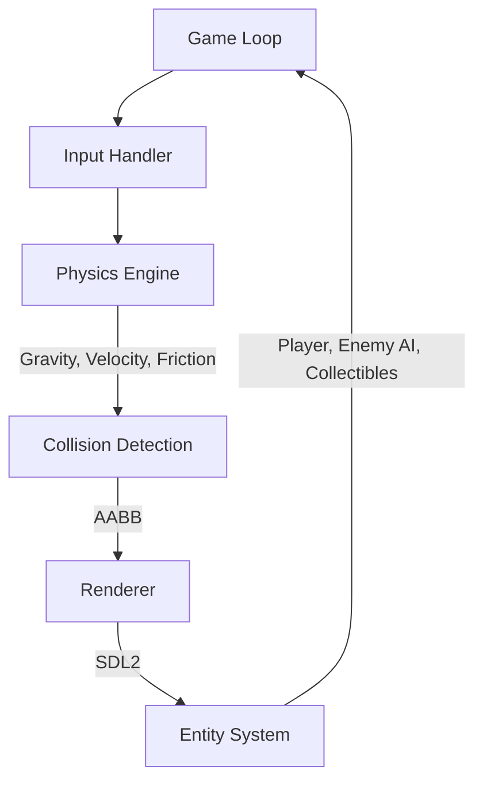

# 🎮 VOID ENGINE (C++ Physics & Game Engine)

**Void Engine** is a custom 2D game engine built entirely from scratch using **C++** and **SDL2**. 
Unlike commercial engines (such as Unity or Unreal Engine), this project is built WITHOUT commercial engines, meaning it handles memory management, the rendering loop, and physics calculations entirely manually. It serves as an exploration into lower-level game development and system programming.


## 🏗️ Architecture



## 🚀 Features
* **Custom Physics Engine:** Implements gravity, velocity, and basic friction logic manually.
* **AABB Collision Detection:** Pixel-perfect axis-aligned bounding box collision system for platforms and entities.
* **Entity System:** Custom lightweight structures for Player, Enemy AI, and Collectibles.
* **Game Loop:** Optimized render loop running at a stable framerate (60 FPS target).
* **AI System:** Patrol-based Enemy AI with boundary checks.
* **Rendering:** Direct drawing and clearing of the screen using SDL2.

## 📋 Prerequisites

To compile and run this project, you need to install SDL2.

**Windows (MinGW):**
Download the SDL2 development libraries for MinGW from the [libsdl.org](https://libsdl.org/) website. Extract them and link the include and lib folders in your compiler path.

**Linux (Ubuntu/Debian):**
```bash
sudo apt-get update
sudo apt-get install libsdl2-dev
```

**macOS:**
```bash
brew install sdl2
```

## 🛠️ Build Instructions

To build the project using `g++`, open your terminal and run the following command (adjust paths depending on your OS and SDL2 installation):

```bash
g++ main.cpp -o void_engine -lSDL2main -lSDL2
```
*Note: On Windows with MinGW, you might need to specify the include and library paths using `-I` and `-L` flags.*

To run the compiled executable:
```bash
# Windows
./void_engine.exe

# Linux/macOS
./void_engine
```

## 🎮 Controls
* **Arrow Keys:** Move Left / Right
* **Space:** Jump
* **Goal:** Collect all yellow boxes (coins) without touching the red enemies.

## 📁 Project Structure

```text
Void-Engine-CPP/
├── main.cpp         # Main game logic, physics, and rendering loop
├── screenshot.png   # Gameplay screenshot
├── README.md        # Project documentation
├── LICENSE          # MIT License
└── .gitignore       # Git ignore file
```

## 🧠 What I Learned

Building this engine from scratch taught me valuable lessons about low-level software architecture:
* **Physics Simulation:** Understanding how to calculate gravity and velocity updates per frame without relying on a pre-built physics engine like Box2D.
* **Memory Management:** Managing objects and rendering contexts safely in C++ to prevent memory leaks.
* **Game Loops:** Designing a robust infinite loop that handles input, updating state, and rendering to the screen synchronously.

---
*Developed by Abdulkadir Turan as a System Programming Portfolio Project.*